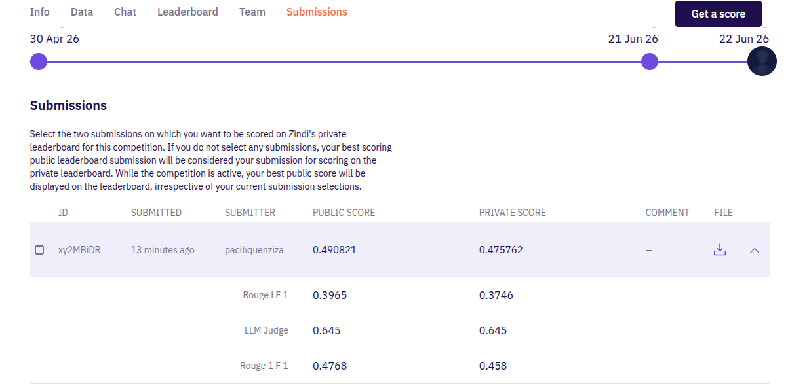
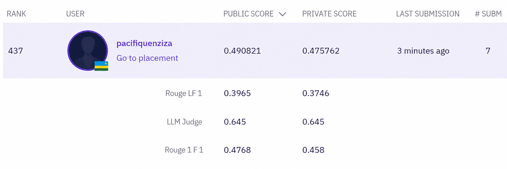

# Multilingual Health QA (HASH / Zindi)

Fine-tuning a multilingual seq2seq model to answer maternal, sexual & reproductive
health questions in low-resource African languages (Akan, Amharic, Luganda, Swahili)
plus English across 8 language-country subsets.

> **Leaderboard metric:** `0.37·ROUGE-1 F1 + 0.37·ROUGE-L F1 + 0.26·LLM-judge`.
> 74% is lexical overlap, so the winning strategy is generating answers in the correct
> language & script that reuse the reference vocabulary.

## Results so far

| Run | Model | Val ROUGE-1 | Val ROUGE-L | Val proxy* | LB public |
|-----|-------|------------:|------------:|-----------:|----------:|
| B0  | TF-IDF retrieval (CPU, no training) | 0.4212 | 0.3660 | **0.3936** | **0.4908** |

\* proxy = `0.5·R1 + 0.5·RL`, our offline north-star (the lexical 74% of the leaderboard).
Full history: [experiments/log.md](experiments/log.md) · [results.csv](experiments/results.csv).

**Leaderboard submission** (B0, `xy2MBiDR`): public **0.4908** / private **0.4758**.
Components ROUGE-1 0.4768, ROUGE-L 0.3965, LLM-judge 0.645.





## Repo layout

```
src/
  data.py            load/clean/split, subset→language metadata, "<subset>: <q>" prefixing
  preprocess.py      Unicode NFC + whitespace normalization, Ge'ez/Latin script diagnostics
  metrics.py         ROUGE-1/L F1 mirroring the organizers' scorer + weighted proxy
  baseline_tfidf.py  B0: GPU-free TF-IDF char-ngram retrieval baseline
  train.py           seq2seq fine-tune (mT5 / NLLB) via HF Seq2SeqTrainer
  infer.py           batch generation → Val ROUGE report + reviewable Test submission CSV
  submit.py          enforce the 4-column Zindi format (LOCAL FILE ONLY, never uploads)
  eda.py             generate all EDA figures + findings JSON
notebooks/
  01_eda.ipynb       narrated EDA (figures + preprocessing rationale)
  colab_run.ipynb    end-to-end Colab: install, train, evaluate, reviewable submission
experiments/         log.md + results.csv (one row per run)
reports/figures/     EDA + results figures (PNG)
datasets/            Train/Val/Test CSVs (given)
```

## Quickstart (local, CPU: EDA + baseline)

```bash
pip install -r requirements.txt          # or: pandas numpy matplotlib rouge-score scikit-learn
python -m src.eda                        # → reports/figures/*.png + reports/eda_findings.json
python -m src.baseline_tfidf             # → Val ROUGE + outputs/tfidf_*_predictions.csv
```

## Local CPU smoke test (optional)

No CUDA GPU is required to *validate the pipeline*. On CPU you can run a tiny end-to-end
check (train → infer → ROUGE) before spending a cloud GPU session:

```bash
pip install torch --index-url https://download.pytorch.org/whl/cpu
pip install transformers==4.44.2 datasets==2.21.0 accelerate sentencepiece
bash scripts/smoke_test.sh        # mt5-small, ~2k rows, 1 epoch, ~25 min on CPU
```

This trains a deliberately undertrained model (scores will be low). It only proves the
code runs locally. Real leaderboard training needs a GPU (CPU full fine-tunes are
10 to 50x slower and RAM-bound). Use Kaggle (free T4, 30 h/week) or Colab.

## Fine-tuning (Colab GPU)

Open [notebooks/colab_run.ipynb](notebooks/colab_run.ipynb) (GPU runtime), or:

```bash
python -m src.train --model_name google/mt5-base --output_dir outputs/mt5base_v1 \
  --epochs 3 --train_bs 8 --grad_accum 2 --lr 3e-4 \
  --max_input_len 128 --max_target_len 256 --num_beams 4 --no_repeat_ngram 3 --fp16

python -m src.infer --model_dir outputs/mt5base_v1 --split val  --tag mt5base_v1  # ROUGE
python -m src.infer --model_dir outputs/mt5base_v1 --split test --tag mt5base_v1  # submission CSV
```

## Submission policy

`src/submit.py` / `src/infer.py` only **write a local CSV** in the required 4-column format
(`ID, TargetRLF1, TargetR1F1, TargetLLM`, identical answer in all three). **Nothing uploads
automatically.** Review predictions (script/length spot-checks, beat the B0/prior proxy)
*then* upload to Zindi yourself and record the LB score in `experiments/`.

## Reproducibility notes

- ROUGE uses the `rouge-score` library with a whitespace tokenizer and `use_stemmer=False`,
  byte-for-byte the organizers' setup (verified from the official starter notebook), so Val
  numbers track the hidden leaderboard for the lexical 74%.
- Amharic is **Ge'ez script** (96.6% of its answer chars); `infer.py` flags Amharic predictions
  that aren't Ge'ez as a wrong-language guard.
- No exact-input leakage train↔val↔test (checked in `data.leakage_report`).
- Random seed 42 throughout; deps pinned in `requirements.txt`.
